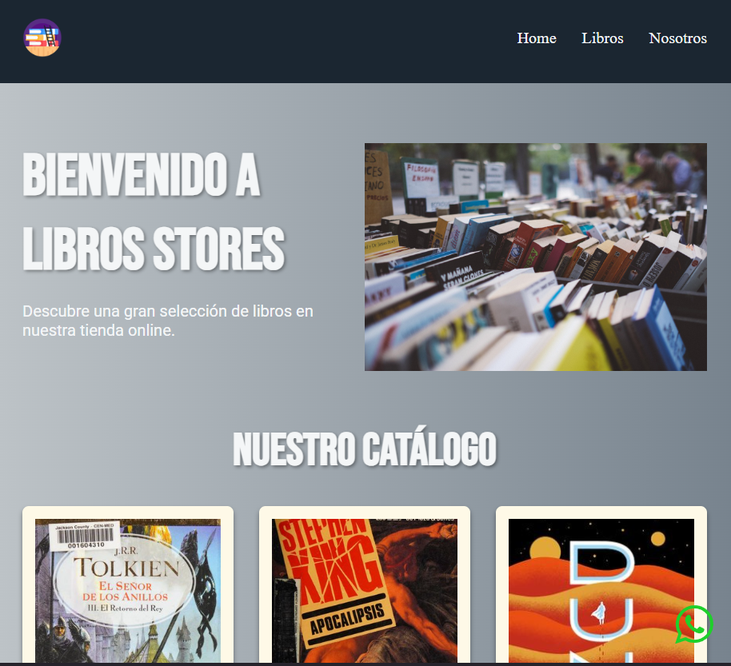

# Libros Stores 📚
Una librería online ficticia construida con HTML y CSS, JS. En este proyecto vamos a estar practicando varios conociminetos.
La pagina va a tener una index donde tenemos una barra de navegacion, un seccion de bienvenida, cards que son los libros a comprar y un footer.


## Preview


## Tecnologías
- HTML
- CSS (Flexbox y Grid)
- Diseño responsive con Media Queries
- JS

## Páginas
- **Home** (`index.html`): Bienvenida, catálogo de libros con cards.
- **Producto** (`pages/producto.html`): Detalle de un libro individual.
- **Nosotros** (`pages/nosotros.html`): Información sobre la librería.

## Estructura del proyecto
```
libros-stores/
├── index.html
├── pages/
│   ├── producto.html
│   └── nosotros.html
├── css/
│   └── estilos.css
└── img/
```
## Cómo correrlo
1. Cloná o descargá el repositorio.
2. Abrí `index.html` en tu navegador.
<br>
No requiere instalación ni dependencias.